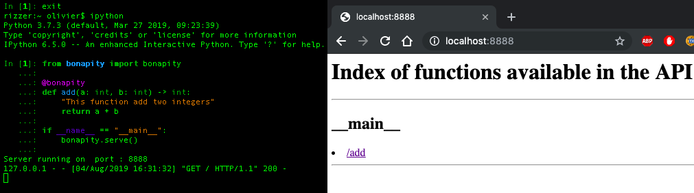
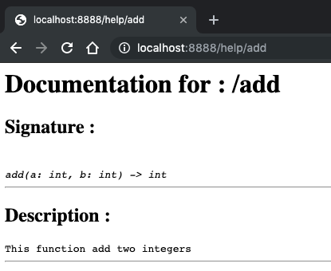
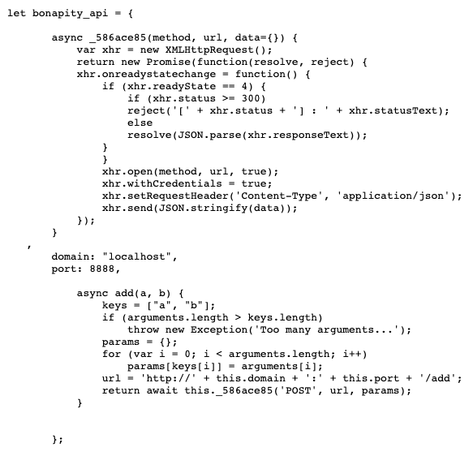

Tutorial
=========

This chapter provide a quick tutorial on how to use ``bonapity`` easily.

First let's install the latest version of bonapity with ``pip`` :

.. code:: bash

    pip3 install bonapity

Seriously ! it's only 3 Lines
^^^^^^^^^^^^^^^^^^^^^^^^^^^^^^

You can create a cool API for your project by knowing only three lines !

.. code:: python

    # The import line
    from bonapity import bonapity

    # The decorator
    @bonapity

    # Starting the server
    bonapity.serve()

Honestly, I can't do simpler !

First Sample
^^^^^^^^^^^^^^

Sounds incredible ? Let's try it by yourself, open a python terminal and let's write our first API.

.. code:: python

    from bonapity import bonapity

    @bonapity
    def add(a: int, b: int) -> int:
        "This function add two integers"
        return a + b
    
    if __name__ == "__main__":
        bonapity.serve()

The server should be running, open your browser and write ``http://localhost:8888/`` into your url bar.
By default, the server will return you the listing of all your functions usable throught the API.

Here, there is only one function : ``add``.
You want, for each function, know the signature and the purpose ?
Ok, just click on the link, it will bring you to ``/help/FUNCTION_NAME`` where a generated doctumentation is served too.

Now you can test it by giving parameters throught the url sur as : 
``http://localhost:8888/add?a=23&b=19``.

But you can test all the ``REST`` verbs with the ``curl`` command :

.. code:: bash

    curl -X GET "http://localhost:8888/add?a=1&b=3"
    curl -X DELETE "http://localhost:8888/add?a=1&b=3"
    curl --data '{"a": 1, "b": 3}' -X POST   "http://localhost:8888/add" -H "Content-Type: application/json"
    curl --data '{"a": 1, "b": 3}' -X PATCH  "http://localhost:8888/add" -H "Content-Type: application/json"
    curl --data '{"a": 1, "b": 3}' -X PUT    "http://localhost:8888/add" -H "Content-Type: application/json"

Great ! you did it ! want to know more ? ok, let's continue reading... 📚

How my data is sent / received ?
^^^^^^^^^^^^^^^^^^^^^^^^^^^^^^^^^

Your function expect parameters, for ``GET`` and ``DELETE`` they can be passed :

- as a query string (url parameters), each parameter is considered as a JSON,
  so you can give list or dictionnary to each parameter. 
  Example:  ``/myfun?param1=value1&param2=value2``.
- as a serialized pickle binary of the dict with keys as argument names 
  and values as values, in this case, the url should not contains any argument
  value, the only argument (without value) is your binary pickle 
  encoded in ``base64`` (``/myfun?MY_BASE64_ENCODED_DATA``).
  Example: the equivalent of ``/myfun?v=23`` would be 
  ``/myfun?gAN9cQBYAQAAAHZxAUsXcy4=`` because ``gAN9cQBYAQAAAHZxAUsXcy4=`` is 
  the base64 of ``\x80\x03}q\x00X\x01\x00\x00\x00vq\x01K\x17s.`` which is 
  the pickle dump of ``{'v': 23}``.

For ``POST``, ``PUT``, ``PATCH``, you can give them : 

- as a JSON dict 
- as a binary (**not** base64 encoded this time) file

For both case you should precise the ``Content-Type`` in the header.

- ``"Content-Type: application/json"`` for JSON file
- ``"Content-Type: application/python-pickle"`` for pickle file

Be aware that pickle encoding differ between ``python2`` and ``python3``,
we are using ``python3``.

The received data (for all ``REST`` verbs) are, by default returned as JSON 
if they are JSON serializable, else as binary pickle.
If you need to write a javascript client, think that your function can't 
return numpy array (for example) as they are not JSON serializable and javascript
do not understand the pickle format.

We help you to write the client too !
^^^^^^^^^^^^^^^^^^^^^^^^^^^^^^^^^^^^^^

You don't have time to create a complex client ? we help you to write it too.
For python client we provide a simple decorator and for javascript 
we generate a template lib served at ``http://domain:port/help/?js``.
The generation is quite naïve and just an help, 
if you encounter difficulties with the generated lib, consider 
to writte wrappers for your spetial use cases your self.

Python wrappers
----------------

Let's write the client part for our of ``add`` function.

.. code:: python

    from bonapity import vuosi

    @vuosi('localhost', 8888)
    def add(a, b):
        pass
    
You just have to import our ``vuosi`` decorator and write empty function 
with the same signature as the server one. 
So, the decorator will understand which one to use.
The wrapped ``add`` function should be called with the parameter names 
(not positional) : ``add(a=4, b=5)`` is valid, but ``add(6, 2)`` is not.

Javascript wrappers
--------------------

Here we go ! With Cross-Origin-Requests, AJAX, etc. JS can be painful !
Also, we decided to generate some code to help you to make link with the API.
For example, if you go to : ``http://domain:port/help/?js`` you can see the code.

  
The function are contained in a dict, by default, the dict name is  ``bonapity_api``.
Think to replace the ``domain`` and ``port`` attributes.

Because it's easier to get results from promises than putting functions inside 
functions (if success to something), we decided to generate all the function as 
asynchrounous ones.
So it's pretty simple to call it. Just use the ``await``keyword. Example : 

.. code:: javascript

    var res = await add(6, 12);
    console.log(res)

More examples soon...
^^^^^^^^^^^^^^^^^^^^^^^

Stay tuned !

